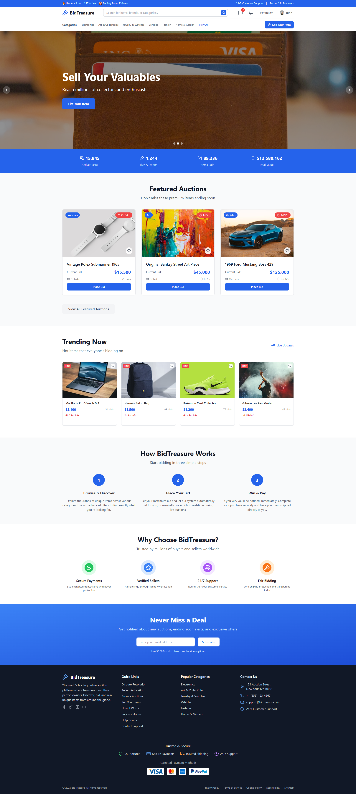
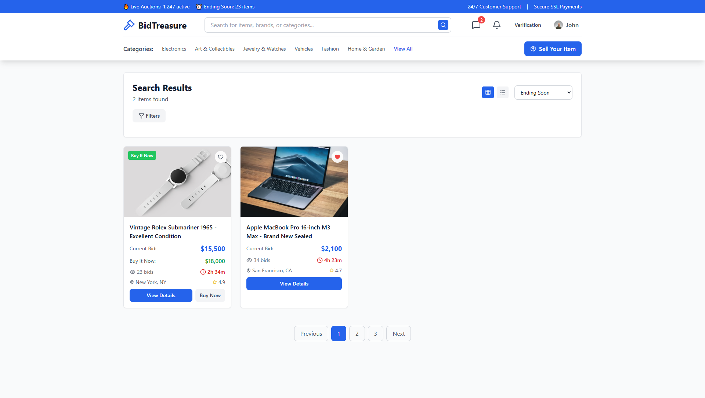
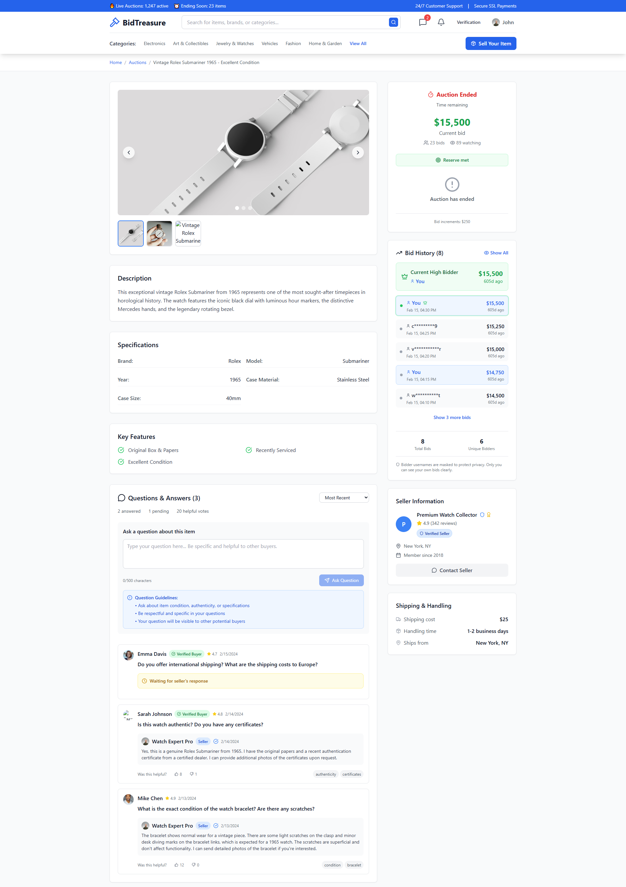
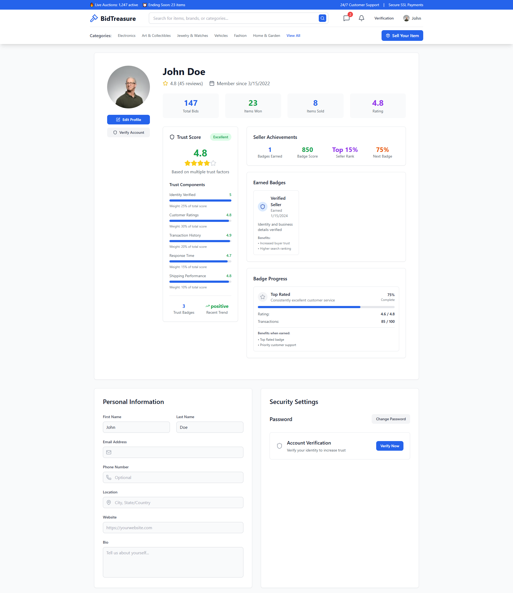

# BidTreasure


<div align="center">
  <div style="background: linear-gradient(135deg, #3B82F6, #1D4ED8); padding: 20px; border-radius: 16px; display: inline-block; margin-bottom: 20px;">
    <svg xmlns="http://www.w3.org/2000/svg" width="32" height="32" viewBox="0 0 24 24" fill="none" stroke="currentColor" color="white" stroke-width="3" stroke-linecap="round" stroke-linejoin="round" class="lucide lucide-gavel h-8 w-8  mr-2" aria-hidden="true"><path d="m14 13-8.381 8.38a1 1 0 0 1-3.001-3l8.384-8.381"></path><path d="m16 16 6-6"></path><path d="m21.5 10.5-8-8"></path><path d="m8 8 6-6"></path><path d="m8.5 7.5 8 8"></path></svg>
  </div>
  <p><em>Discover Rare Treasures - Bid on exclusive items from around the world</em></p>
</div>

<div align="center">

[](https://reactjs.org/)
[](https://vitejs.dev/)
[](https://tailwindcss.com/)
[](LICENSE)
</div>

## Overview

BidTreasure is a modern, feature-rich auction platform built with React and Vite. It provides users with a comprehensive bidding experience, allowing them to discover rare items, participate in live auctions, and manage their collections through an intuitive dashboard.

<div align="center">
  
</div>

## Key Features

### Auction Management
- **Live Bidding System**: Real-time bidding with automatic updates
- **Auto-Bidding**: Set maximum bids and let the system bid for you
- **Buy It Now**: Instant purchase options alongside traditional auctions
- **Auction Categories**: Electronics, Art & Collectibles, Jewelry & Watches, Vehicles, Fashion, and more
- **Advanced Search & Filtering**: Find items by category, price range, condition, and location


### User Dashboard
- **My Bids**: Track all your active and historical bids
- **Won Auctions**: Manage your successful purchases with payment and shipping tracking
- **Watchlist**: Save and monitor interesting items
- **My Listings**: Seller dashboard for managing your auction listings
- **Performance Analytics**: View bidding statistics and success rates

### Selling Platform
- **Multi-Step Listing Process**: Guided item listing with category selection, details, pricing, duration, and shipping
- **Flexible Pricing Options**: Auction-only, Buy It Now, or hybrid approaches
- **Image Gallery**: Multiple photo uploads with drag-and-drop functionality
- **Draft System**: Save incomplete listings and resume later
- **Market Research Tools**: View similar items and pricing suggestions


### Communication System
- **Integrated Messaging**: Direct communication between buyers and sellers
- **Q&A Section**: Public questions and answers about auction items
- **Contact Seller Modal**: Structured inquiry system with predefined templates
- **Real-time Notifications**: Instant updates for messages, bids, and auction events


### Trust & Security
- **Seller Verification System**: Multi-tier verification with badges and ratings
- **Trust Score Calculator**: Algorithm-based seller credibility scoring
- **Feedback & Rating System**: Comprehensive review system for buyers and sellers
- **Dispute Resolution**: Built-in dispute management for transaction issues
- **Secure Authentication**: Email verification and strong password requirements

### User Experience
- **Responsive Design**: Fully optimized for desktop, tablet, and mobile devices
- **Dark Mode Support**: Comfortable viewing in any lighting condition
- **Real-time Updates**: Live auction countdowns and bidding status
- **Advanced Notifications**: Customizable alerts for various auction events
- **Profile Management**: Complete user profile system with verification status


## Technology Stack

- **Frontend Framework**: React 18 with functional components and hooks
- **Build Tool**: Vite for fast development and optimized builds
- **Styling**: Tailwind CSS for utility-first styling
- **Routing**: React Router DOM for client-side navigation
- **State Management**: React Context API for global state
- **Icons**: Lucide React for consistent iconography
- **Form Handling**: Controlled components with validation

## Getting Started

### Prerequisites
- Node.js (version 16 or higher)
- npm or yarn package manager

### Installation

1. Clone the repository:
```bash
git clone https://github.com/ahmed-226/BidTreasure.git
cd bidtreasure
```

2. Install dependencies:
```bash
npm install
```

3. Start the development server:
```bash
npm run dev
```

4. Open your browser and navigate to `http://localhost:5173`

### Available Scripts

- `npm run dev` - Start development server with hot reload
- `npm run build` - Build the project for production
- `npm run preview` - Preview the production build locally
- `npm run lint` - Run ESLint for code quality checks

## Application Screenshots


<div align="center">
  
  <p><em>Seller dashboard for managing auction listings</em></p>
</div>

<div align="center">
  
  <p><em>Won auctions management with payment and shipping tracking</em></p>
</div>

<div align="center">
  
  <p><em>profile page and account settings</em></p>
</div>

## Core Components

### Auction Features
The application provides comprehensive auction functionality including live bidding, auto-bidding capabilities, and various auction formats. Users can participate in traditional auctions or use "Buy It Now" for immediate purchases.

### Dashboard System
A complete user dashboard allows management of all auction activities including active bids, won items, personal listings, and watchlisted items. The dashboard provides detailed analytics and performance metrics.

### Messaging Platform
Built-in communication system enables direct messaging between users, public Q&A sections for auction items, and structured contact forms for seller inquiries.

### Trust Infrastructure
Comprehensive trust and verification system includes seller badges, trust scores, feedback ratings, and dispute resolution mechanisms to ensure safe transactions.

## Configuration

### Tailwind CSS
The project uses Tailwind CSS with custom configuration in [`tailwind.config.js`](tailwind.config.js). Custom colors, fonts, and utilities are defined for the BidTreasure brand.

### PostCSS
PostCSS configuration in [`postcss.config.js`](postcss.config.js) handles Tailwind CSS processing and autoprefixer for browser compatibility.

### Vite Configuration
Vite is configured in [`vite.config.js`](vite.config.js) with React plugin and optimization settings for development and production builds.

## Browser Support

- Chrome (latest)
- Firefox (latest)
- Safari (latest)
- Edge (latest)


## Development Notes

This is a client-side only application built for demonstration purposes. All data is mocked and stored in local state. For production use, you would need to:

- Implement a backend API for data persistence
- Add real-time WebSocket connections for live bidding
- Integrate payment processing systems
- Implement proper authentication and authorization
- Add image upload and storage solutions
- Set up email notification services

## License

This project is licensed under the MIT License - see the LICENSE file for details.
